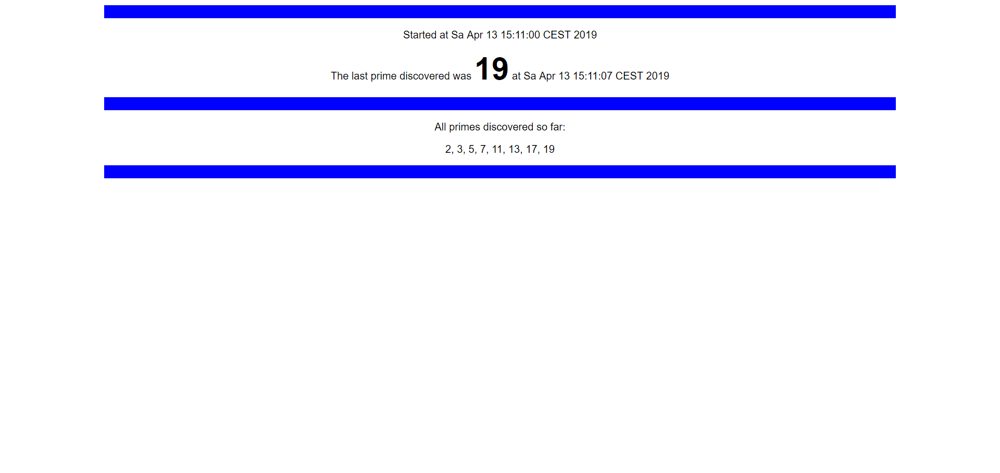

# "*Prime Searcher*"

## Aufgabenstellung
Die detaillierte [Aufgabenstellung](TASK.md) beschreibt die notwendigen Schritte zur Realisierung.

## Implementierung

### Searcher

`Searcher` ist die Klasse, die die Berechnung der Primzahlen durchführt. Sie hat die Annotation `@Component`. Bein annotationsbasierter Konfiguration wird das benötigt, damit die Klasse als "Kandidat" für Automatische Zuweisung erkannt wird.<sup>[[1]](#Quellen)</sup>

Damit die Berechnung im Hintergrund laufen kann, habe ich diese Klasse als Thread-Subklasse implementiert. in der `run()`-Methode wird nach Primzahlen gesucht (einfach mit zwei Schleifen, wobei die äußere einfach Zahl für Zahl durchgeht und die innere überprüft, ob die Zahl einen echten Teiler größer als 1 hat):

``````java
for (long l = 2; l < current; l++) {
    if (current % l == 0) {
        isPrime = false;
        break;
    }
}
``````

Gefundene Primzahlen werden in einem `ConcurrentSkipListSet` gespeichert, um die Nebenläufigkeit zu unterstützen. Mit den Methoden `getPrimes()` und `getPrimesString()` kann man die gefundenen Primzahlen als `ConcurrentSkipListSet` oder als String abfragen.

Beim Starten der `run()`-Methode und jeweils nachdem eine Primzahl gefunden wurde wird der Zeitpunkt in einem `LocalDateTime`-Objekt gespeichert. Diese beiden Zeitpunkte - Start der Berechnung und letzte gefundene Primzahl - können auch abgefragt werden:

- Entweder als `LocalDateTime`, oder
- als String, formatiert mit einem `DateTimeFormatter`


### PrimeSearcherController

Diese Klasse ist der Controller der Spring Boot-Anwendung. Er kümmert sich darum, HTTP-Requests zu beantworten. Daher hat er die Annotation `@Controller`.<sup>[[2]](#Quellen)</sup>

Laut Angabe soll die Anwendung  "auf `/primes` deployed sein". Deshalb habe ich der Klasse eine Annotation `RequestMapping("/primes")` hinzugefügt, damit er nur HTTP-Requests bearbeitet, die auf `/prime` oder eine Unterseite davon zugreifen.

Der Controller hat auch eine Referenz auf die `Searcher`-Klasse. Diese ist `@Autowired` - das heißt, dass das Attribut automatisch eine Referenz auf das Objekt erstellt.<sup>[[3]](#Quellen)</sup> Dafür muss aber eine mit `@Bean` annotierte Methode verfügbar sein, die eine Instanz erzeugt und zurückgibt. Diese Aufgabe erfüllt bei mir die Methode `getSearcher()`, die den Searcher-Thread auch gleich startet:

``````java
@Bean
public Searcher getSearcher() {
    Searcher s = new Searcher();
    s.start();

    return s;
}
``````

#### Ausgabe der Primzahlen

Für die Ausgabe der Primzahlen habe ich ein HTML-Template gemacht. Spring Boot benutzt die Template Engine Thymeleaf, um diese Templates zu verarbeiten - dafür sind die `th:text`-Attribute in den HTML-Tags. `${key}` steht für ein Attribut, auf das über den Key zugegriffen werden kann.

``````html
<!DOCTYPE HTML>
<html xmlns:th="http://www.thymeleaf.org" lang="de">
<head>
    <title>Prime Searcher</title>
    <meta http-equiv="Content-Type" content="text/html; charset=UTF-8" />
	<style>
		/* Styles... */
	</style>
</head>
<body>
    <div id="container">
        <div class="rect"></div>

        <p>Started at <span th:text="${startup}"></span></p>
        <p>The last prime discovered was <span id="last-prime" th:text="${latestPrime}"></span> at <span th:text="${latestPrimeDiscovered}"></span></p>

        <div class="rect"></div>

        <p>All primes discovered so far:</p>
        <p th:text="${allprimes}"></p>

        <div class="rect"></div>
    </div>
</body>
</html>
``````

Diese Seite lässt sich über `/primes/searcher` aufrufen. Dafür habe ich eine Methode `getPrimes(Model model)` hinzugefügt. Mit der Annotation `@RequestMapping("/searcher")` habe ich festgelegt, dass diese Methode ausgeführt werden soll, wenn die Unterseite `/searcher` aufgerufen werden soll.<sup>[[4]](#Quellen)</sup> Nachdem die ganze Klasse nur für `/primes` verantwortlich ist, ist die URL dafür dann `/primes/searcher`.

Die Methode fügt dem per Parameter übergebenen Model vier Attribute hinzu: Den Start-Zeitpunkt der `Searcher`-Klasse (`startup`), die letzte gefundene Primzahl (`latestPrime`), den Zeitpunkt zu dem diese Primzahl gefunden wurde (`latestPrimeDiscovered`) und eine Liste aller bisher gefundenen Primzahlen als String (`allprimes`). Diese Werte werden dann ins HTML-Template (siehe oben) eingesetzt.

Die Methode gibt den String `"searcher"` zurück. Das ist der Dateiname des Template-Files: `searcher.html`.<sup>[[5]](#Quellen)</sup>

Das Template-File mit den eingesetzten Werten sieht im Browser dann so aus:




#### Automatische Weiterleitung

Wenn ein Besucher auf die Unterseite `/primes` geht, soll er automatisch auf `/primes/searcher` weitergeleitet werden. Das geht ganz einfach. Die Methode braucht die Annotation `@RequestMapping({"", "/"})`, um festzulegen, dass sie sich um HTTP-Requests für `/primes` und `/primes/` kümmern soll (leider ist das in Spring nicht das selbe).

Die Methode bekommt als Parameter ein `HttpServletRequest`- und ein `Http-Servlet-Response`-Objekt. Dann muss nur noch mit dem Aufruf von `sendRedirect("/primes/searcher")` die Weiterleitung eingerichtet und die mögliche `IOException` abgefangen werden und die Weiterleitung funktioniert.<sup>[[6]](#Quellen)</sup>

## Quellen

[1] [Component - Spring API Docs - abgerufen am 13.4.2019 um 14:33](https://docs.spring.io/spring/docs/5.2.0.M1/javadoc-api/org/springframework/stereotype/Component.html)
[2] [Controller - Spring API Docs - abgerufen am 13.4.2019 um 14:36](https://docs.spring.io/spring/docs/5.2.0.M1/javadoc-api/org/springframework/stereotype/Controller.html)
[3] [Autowired - Spring API Docs - abgerufen am 13.4.2019 um 14:42](https://docs.spring.io/spring/docs/5.2.0.M1/javadoc-api/org/springframework/beans/factory/annotation/Autowired.html)
[4] [RequestMapping - Spring API Docs - abgerufen am 13.4.2019 um 15:04](https://docs.spring.io/spring/docs/5.2.0.M1/javadoc-api/org/springframework/web/bind/annotation/RequestMapping.html)
[5] [Return Values for Spring MVC Handler Methods - Spring Reference Docs - abgerufen am 13.4.2019 um 15:06](https://docs.spring.io/spring/docs/current/spring-framework-reference/web.html#mvc-ann-return-types)
[6] [A Guide To Spring Redirects - baeldung.com - abgerufen am 13.4.2019 um 15:13](https://www.baeldung.com/spring-redirect-and-forward)